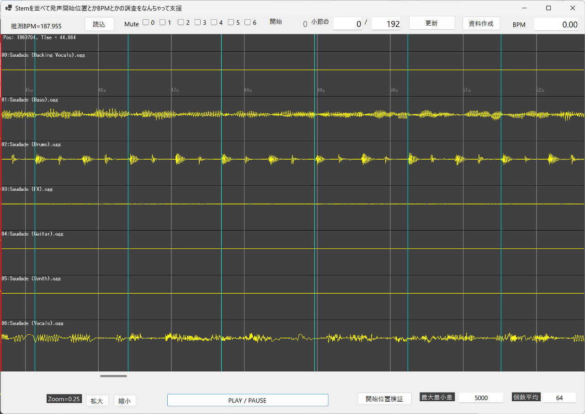
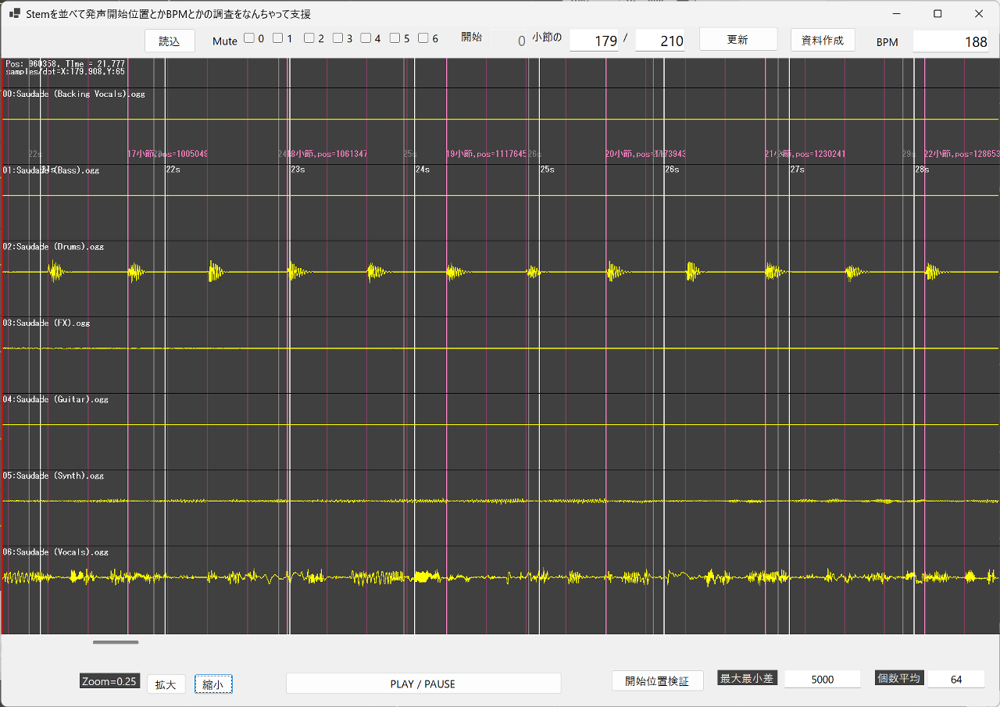
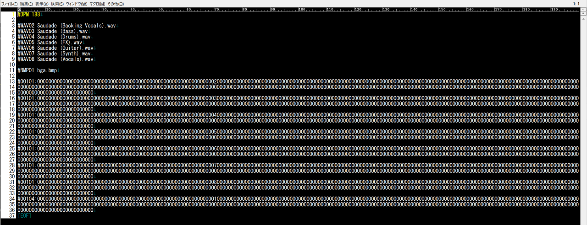
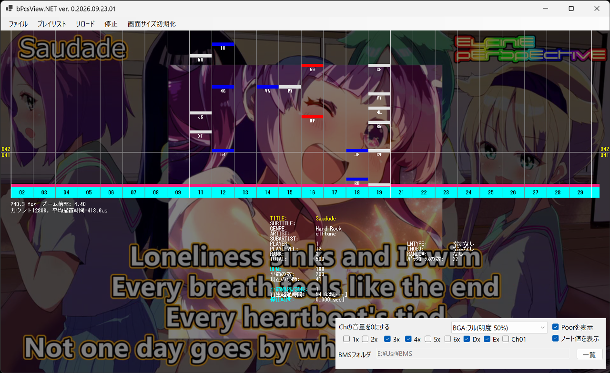

# Stemを並べて発声開始位置とかBPMとかの調査をなんちゃって支援 (SHbN)

## Notice
```
This repository is for personal use only.I do not accept any Issues or Pull Requests.
```

## 対象
Sunoで作ったStemの音声ファイル群の発声開始位置やBPM等を調査したい方。

## プチ詳細
Sunoの有料プランで曲を作ると楽器やボーカルごとに別れた.mp3ファイル群をダウンロードできます。Stem(ステム)と呼ばれるファイルです。じゃあBMSのバックコーラスに使おうじゃないか！と思ったのですが、BPMはわからないし再生開始位置もデータの最初からではない。
調べるツールが欲しいなぁということで作りました。あくまで「なんちゃって支援」です。完全に自動でBPMや開始位置を特定することはできません。人間が目視で確認しながら調整するためのツールです。

## 開発環境
バイナリでは配布しませんので各自環境をそろえてビルドしてください。

- Windows 11 + 4Kディスプレイ (2560x1440でもいけると思います。)
- [Visual Studio 2026](https://visualstudio.microsoft.com/ja/vs/) (VSCode + C# Dev Kitでもいけると思いますが後述の理由によりVisual Studio 2026を推奨します。)
- [.NET 10.0 SDK](https://dotnet.microsoft.com/ja-jp/download/dotnet/10.0)

## 前提条件
- ウィンドウ内のレイアウトですが4K+175%拡大表示に合わせていますので各自調整ください（その意味でもVSCodeよりVisual Studio 2026の方がおすすめです。）
- Sunoで作った一曲分しか検証していません(笑)
- コードは超絶テキトーでエラー処理もちょろっとしかしていません。完全自己責任でお願いします
- 44.1 or 48.0kHz, ステレオ, 16bitの音声ファイルのみ対応です。全てフォーマットは揃えてください(44.1kHzでしか検証していません)
- SunoのStem群は.mp3ですが、ffmegなどで事前に.oggに変換しておいてから実行されることをお勧めします（.mp3だと読み込みが3倍くらい遅い)

## 使い方
- [読込] でStemに分けている音声ファイル群を指定して読み込んでください。7ファイルまで。今回は拙作[Saudade](https://youtu.be/2u10DkyGzyo)のStemを使いました。
- [縮小]とスクロールバーで、ドラムが規則的に鳴っている部分など、わかりやすそうな場所を表示します。
- 薄い白線は、このファイルの実際の秒数を示しています。
- 「だいたいこのへんが一小節の長さに該当するかな」という部分を左クリックと右クリックで指定します。水色の縦線が表示されます。



- 左上に「推測BPM」が表示されます。この例では幸いにも(？)187.955と表示されたので「たぶん188かな」と推測されます。[Esc]を押して水色線を消し、[BPM]に188と入力して「更新」をクリックします
- ざっくりスクロールして、間隔（BPM）はこんなものか、と確認できたら先頭部分にスクロールし、拡大します
- ~~「小節の 0 / 192」となっている部分を「179 / 210」と入力して「更新」をクリックします。これで発声開始位置が決まりました。一小節を210等分したうちの179番目から音が鳴る、という意味です。つまり、最初の小節(0小節目)の179/210の位置から再生開始すれば31/210経過したところから1小節目が始まります。（ここの数値は適当に試行錯誤していい感じに決めてください。）~~
- ↑あらためてやってみたらこっちの数値の方がよかったので修正⇒　 「小節の 0 / 192」となっている部分を「41 / 48」と入力して「更新」をクリックします。これで発声開始位置が決まりました。1小節を48等分したうちの41番目から音が鳴る、という意味です。つまり、最初の小節(0小節目)の41/48の位置から再生開始すれば7/48経過したところから1小節目が始まります。（ここの数値は適当に試行錯誤していい感じに決めてください。）
- ざっくりスクロールして、開始位置、小節の間隔（BPM）を確認します
- 濃い白線は、このファイルの再生開始位置からの秒数を示しています



- これでよければ「資料作成」でデータを保存します
- データはこのような内容です。`#00101:xxxx`から始まっていますが`#00001:xxxx`からにしたい場合は、ご面倒ですが手動で修正願います（自分は2小節から始めているので。）





- これでBMSのバックコーラスに使えるようになりました。お疲れさまでした。

## 補足
- 右下の[開始位置検証]あたりは忘れてください（ちゃんと動いていないと思うし使いみちが無い）
- 音声ファイルを読み込むときは非同期処理などを実装していないので完全にアプリの画面は停止します。
 
## 謝辞
 本ソフトウェアでは下記のライブラリ等を使用しています。ありがとうございます。

1) [ＤＸライブラリ](https://dxlib.xsrv.jp/index.html)

2) Ogg Vorbisライブラリ
```
　　　Copyright (C) 2002-2009 Xiph.org Foundation

　　　Redistribution and use in source and binary forms, with or without
　　　modification, are permitted provided that the following conditions
　　　are met:

　　　- Redistributions of source code must retain the above copyright
　　　notice, this list of conditions and the following disclaimer.

　　　- Redistributions in binary form must reproduce the above copyright
　　　notice, this list of conditions and the following disclaimer in the
　　　documentation and/or other materials provided with the distribution.

　　　- Neither the name of the Xiph.org Foundation nor the names of its
　　　contributors may be used to endorse or promote products derived from
　　　this software without specific prior written permission.

　　　THIS SOFTWARE IS PROVIDED BY THE COPYRIGHT HOLDERS AND CONTRIBUTORS
　　　``AS IS'' AND ANY EXPRESS OR IMPLIED WARRANTIES, INCLUDING, BUT NOT
　　　LIMITED TO, THE IMPLIED WARRANTIES OF MERCHANTABILITY AND FITNESS FOR
　　　A PARTICULAR PURPOSE ARE DISCLAIMED. IN NO EVENT SHALL THE FOUNDATION
　　　OR CONTRIBUTORS BE LIABLE FOR ANY DIRECT, INDIRECT, INCIDENTAL,
　　　SPECIAL, EXEMPLARY, OR CONSEQUENTIAL DAMAGES (INCLUDING, BUT NOT
　　　LIMITED TO, PROCUREMENT OF SUBSTITUTE GOODS OR SERVICES; LOSS OF USE,
　　　DATA, OR PROFITS; OR BUSINESS INTERRUPTION) HOWEVER CAUSED AND ON ANY
　　　THEORY OF LIABILITY, WHETHER IN CONTRACT, STRICT LIABILITY, OR TORT
　　　(INCLUDING NEGLIGENCE OR OTHERWISE) ARISING IN ANY WAY OUT OF THE USE
　　　OF THIS SOFTWARE, EVEN IF ADVISED OF THE POSSIBILITY OF SUCH DAMAGE.
```